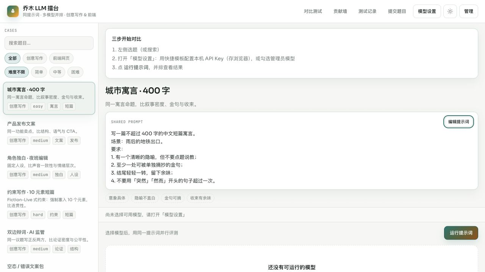

# 乔木 LLM 擂台

**中文** | [English](#english)

[](https://github.com/joeseesun/llm-case-benchmark/actions/workflows/ci.yml)
[](LICENSE)
[](https://benchmark.qiaomu.ai/)



同一个提示词，并排运行多个大模型，直接比较创意写作与前端网页结果。支持自建题库、流式输出、HTML/SVG 预览、评分、历史记录和结果贡献。

**在线体验：** [benchmark.qiaomu.ai](https://benchmark.qiaomu.ai/) · **本地验证：** `npm test`

## 适合谁

- 想用同题实测选模型的产品经理、开发者和内容创作者
- 需要把 Prompt、模型输出和人工评分留档的评测团队
- 希望用自己的 OpenAI 兼容 API 和 Key 搭建内部模型擂台的团队

## 核心能力

| 能力 | 你得到什么 |
| --- | --- |
| 多模型并行 | 一次选择多个服务商与子模型，完成后立即独立展示结果 |
| 两类评测 | Markdown 文本与 HTML/SVG 前端任务均可运行和预览 |
| 流式反馈 | 每张结果卡片独立显示生成进度，不必等全部模型结束 |
| 题库工作流 | 搜索、筛选、提交题目；管理员可原位修改 Prompt 并保存运行 |
| 结果管理 | 单模型重跑、复制、全屏、新窗口、导出、贡献与人工打分 |
| 历史记录 | 标准题库每次运行自动留存，便于回看当时的模型与输出 |
| 本地优先密钥 | 普通用户的 API Key 只保存在浏览器本地；站点 Key 仅由管理员配置 |

## 快速开始

### 1. 启动公开功能

需要 Node.js 22 或更高版本。

```bash
git clone https://github.com/joeseesun/llm-case-benchmark.git
cd llm-case-benchmark
npm ci
npm start
```

打开 <http://127.0.0.1:3168>。首次启动会创建 `data/benchmark.db`，该文件已被 Git 忽略。

### 2. 启用管理员功能

新数据库没有默认管理员密码。只有显式设置环境变量，管理员登录才会启用：

```bash
export BENCHMARK_ADMIN_PASSWORD='replace-with-a-long-random-password'
export BENCHMARK_SECRET='replace-with-at-least-32-random-characters'
npm start
```

`BENCHMARK_SECRET` 用于加密管理员保存到 SQLite 的服务商 API Key。生产环境请通过 systemd、容器 Secret 或托管平台的环境变量管理，不要写入源码、提交记录或前端代码。

> `.env.example` 只是字段示例。本项目不会自动加载 `.env`；请由 shell、进程管理器或部署平台注入环境变量。

## 模型配置

前台「模型设置」支持多个服务商配置与多个子模型：

1. 选择 OpenAI、DeepSeek 或其他 OpenAI 兼容服务商模板。
2. 填写 Base URL 与 API Key，并拉取或手动添加模型。
3. 在题库或对比测试页勾选本次要运行的服务商和子模型。

普通用户配置保存在当前浏览器 `localStorage`，不会上传到站点。管理员可在后台配置站点公共模型，其 Key 加密存入本机 SQLite；公开 API 只返回脱敏后的模型信息。

## 数据与安全边界

| 数据 | 存储位置 | 是否进入仓库 |
| --- | --- | --- |
| 公开题库种子 | `data/cases.json` | 是 |
| SQLite 数据库 | `data/benchmark.db` | 否 |
| API Key | 浏览器本地或加密后的 SQLite | 否 |
| 管理员密码 | 数据库中的 bcrypt 哈希 | 否 |
| 服务端加密密钥 | 环境变量或数据库生成值 | 否 |
| 公开贡献种子 | `data/contributions.json` | 是，不包含 Key |

不要把生产数据库复制进公开仓库。发现安全问题请阅读 [SECURITY.md](SECURITY.md)。

## 项目结构

```text
public/             无构建步骤的前端页面与交互
lib/                SQLite、加密与题目增强逻辑
data/cases.json     公开题库种子
deploy/             systemd 与 Nginx 示例
test/               Node.js 内置测试
server.js           Express API、模型代理与流式输出
```

## 开发与验证

```bash
npm ci
npm test
NODE_ENV=development npm start
curl http://127.0.0.1:3168/healthz
```

项目没有前端构建步骤，Express 直接提供 `public/` 静态文件。模型请求会产生第三方 API 费用，并受对应服务商的速率、内容与数据政策约束。

## 部署

`deploy/` 提供 systemd 和 Nginx 示例。部署前至少应：

- 为 `BENCHMARK_ADMIN_PASSWORD` 和 `BENCHMARK_SECRET` 设置独立强随机值
- 使用 HTTPS，并只让应用端口监听内网或回环地址
- 持久化并定期备份 `data/benchmark.db`
- 限制数据库、环境变量和进程管理配置的文件权限

## 贡献

欢迎提交 Issue 和 Pull Request。开始前请阅读 [CONTRIBUTING.md](CONTRIBUTING.md) 与 [CODE_OF_CONDUCT.md](CODE_OF_CONDUCT.md)。

## 关于向阳乔木

由 [向阳乔木](https://qiaomu.ai/) 开发和维护。一位把前沿 AI 变化转成可用工作流、产品判断与开源实践的 AI 产品/内容创作者。

- [乔木博客](https://blog.qiaomu.ai/) · [乔木推荐](https://tuijian.qiaomu.ai/)
- X [@vista8](https://x.com/vista8) · GitHub [@joeseesun](https://github.com/joeseesun)
- 微信公众号：向阳乔木推荐看

## License

[MIT](LICENSE) · Copyright (c) 2026 向阳乔木

---

<a name="english"></a>

# Qiaomu LLM Arena

Run one prompt across multiple language models and compare writing or frontend results side by side. The app supports a reusable case library, streaming output, HTML/SVG previews, scoring, run history, exports, and community contributions.

**Live demo:** [benchmark.qiaomu.ai](https://benchmark.qiaomu.ai/) · **Verified with:** `npm test`

## Quick Start

Node.js 22 or newer is required.

```bash
git clone https://github.com/joeseesun/llm-case-benchmark.git
cd llm-case-benchmark
npm ci
npm start
```

Open <http://127.0.0.1:3168>. A fresh install has no default administrator password. To enable admin access, provide explicit secrets through your shell or process manager:

```bash
export BENCHMARK_ADMIN_PASSWORD='replace-with-a-long-random-password'
export BENCHMARK_SECRET='replace-with-at-least-32-random-characters'
npm start
```

The app does not automatically load `.env`. Browser-side provider keys stay in local storage. Site-wide provider keys are configured by an administrator, encrypted, and stored in the local SQLite database. Production databases and environment files are excluded from Git.

## Main Features

- Run selected providers and child models in parallel
- Stream each result independently and rerun one model at a time
- Render Markdown, HTML, SVG, and source views
- Edit official prompts in place as an administrator
- Save standard-case run history, export results, and publish safe contributions
- Self-host with Express, SQLite, systemd, and Nginx

## Verification

```bash
npm ci
npm test
npm start
curl http://127.0.0.1:3168/healthz
```

Model calls may incur third-party API costs and remain subject to each provider's policies. See [SECURITY.md](SECURITY.md), [CONTRIBUTING.md](CONTRIBUTING.md), and the [MIT license](LICENSE).

Maintained by [Qiaomu / Joe](https://qiaomu.ai/) · X [@vista8](https://x.com/vista8) · GitHub [@joeseesun](https://github.com/joeseesun)
